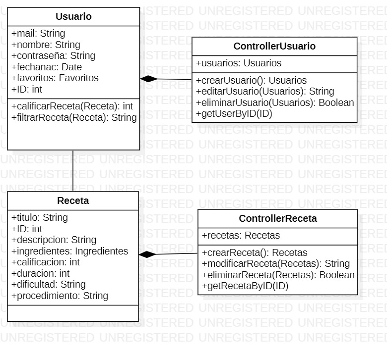
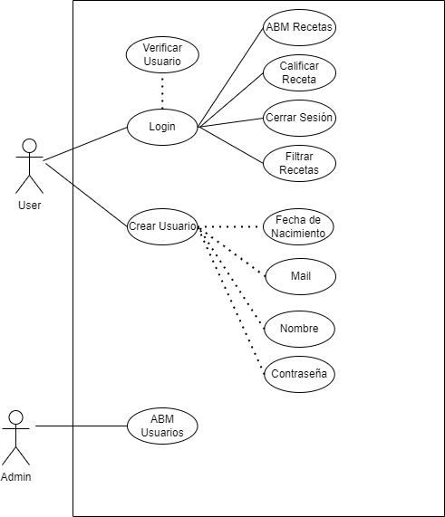

# Recet.ar | Cociná rápido y sencillo

## TPO: Aplicaciones Interactivas
#### El objetivo de este trabajo es realizar una página de Recetas completamente funcional, desde su estructura, desarrollo Frontend, Backend e integración con una Base de Datos

### Tabla de Contenidos
* [Estructura de la Aplicación](#application-structure)
* [Ejecutar el proyecto localmente desde una nueva Terminal](#run-locally)
* [Base de Datos](#Base-de-Datos)
* [Documentacion Utilizada](#documentation)


## Autores

- Diaco Juan Cruz
- Souto Luciana Belen


## Estructura de la Aplicación

En este proyecto se utilizó:
- Javascript
- Bootstrap
- React
- NodeJS
- MongoDB
### _Diagrama de Clases_

### _DCU_


## Ejecutar el proyecto localmente desde una nueva Terminal

- Es necesario contar con los ambos repositorios corriendo localmente para que la aplicación funcione en su totalidad.

### _Repositorio donde reside el Frontend:_

```bash
  git clone https://github.com/juandiaco/TP-API
```

Ir hacia el directorio del proyecto

```bash
  cd react-test-folder
```

Instalar las dependencias necesarias para ejecutar el proyecto

```bash
  npm install
```

Ejecutar el Servidor

```bash
  npm start
```

El proyecto debería redirigirse al siguiente URL:

```bash
http://localhost:3000/
```

### _Repositorio donde reside el Backend:_

```bash
  git clone https://github.com/juandiaco/NodeJSTP
```
Instalar las dependencias necesarias para ejecutar el proyecto

```bash
  npm install
```

Ejecutar el Servidor

```bash
  node src/index
```

El output debería mostrarse de la siguiente manera:

```bash
Server on port 5000
Se conectó a la DB
```


## Documentación utilizada

- [Funcionamiento de ReactJs](https://es.reactjs.org/)
- [Incluir Bootstrap al Proyecto ReactJs](https://react-bootstrap.github.io/)
- [Documentación sobre mongodb](https://www.mongodb.com/docs/)


